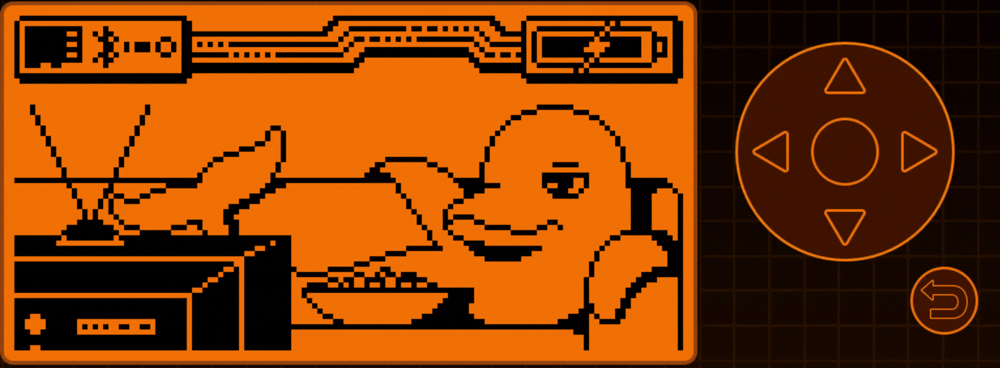

Collection of Flipper. Raspberry and generic Linux funnies, these are all for educational purposes ofcourse.

  

## Flipper

- Official Flipper Github ([Flipper Devices · GitHub](https://github.com/flipperdevices))
- Huge Flipper Collection ([Awesome Flipper · GitHub](https://github.com/djsime1/awesome-flipperzero))

    

## BadUSB

- My bad badUSB scripts ([Mine](https://github.com/mexersus/flipperme/tree/main/badUSB))  
  Mainly adaptations of found broken scripts and some fresh ones.

    

## RaspberryPi

Collection of some handy RPI things.

    

## Linux

Collection of some Linux related scripts, daemons and links.  
Since i'm pretty much a Kali/Debian/Ubuntu adept its covers that.

.
